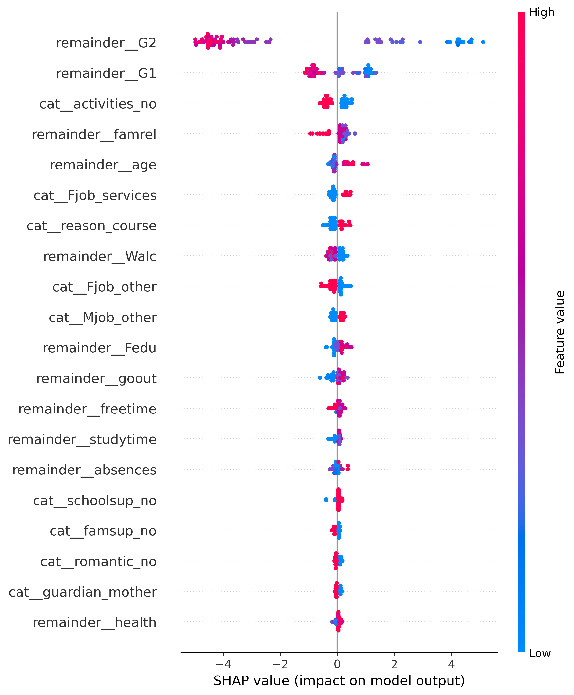
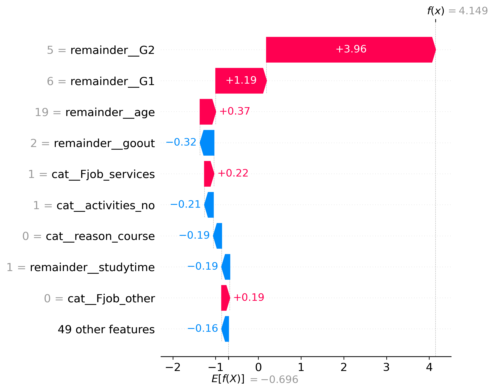
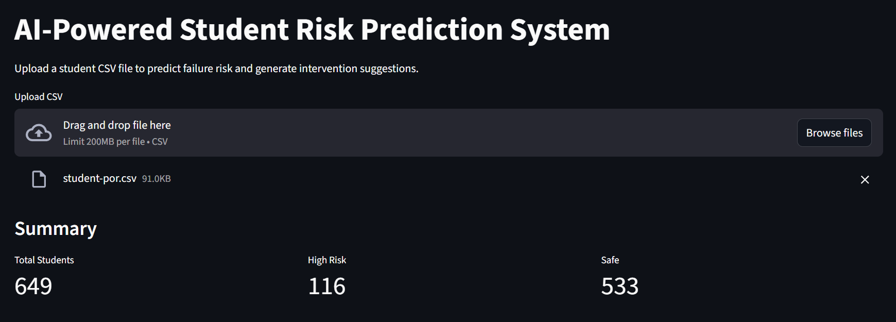
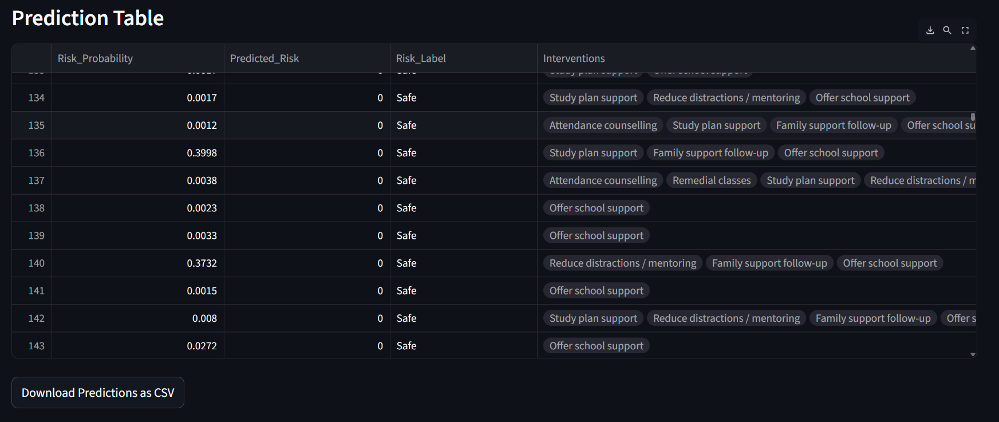
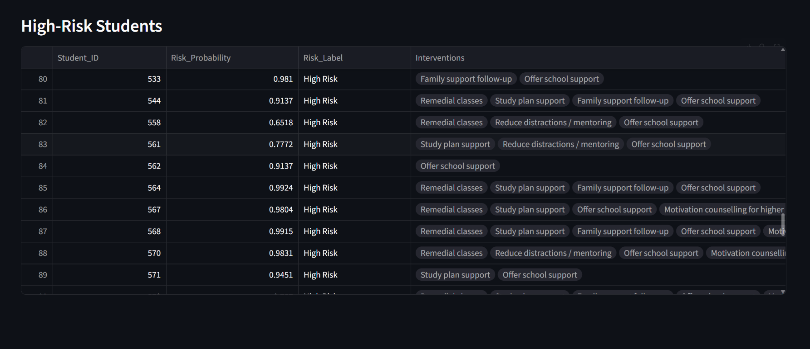

# AI-Powered Student Risk Prediction System

## Overview

The AI-Powered Student Risk Prediction System is a machine learning application designed to identify students who are at risk of academic failure and recommend suitable interventions.

The system uses an XGBoost classification model trained on the UCI Student Performance Dataset and provides explainable predictions using SHAP (SHapley Additive Explanations). A Streamlit-based dashboard allows users to upload student datasets, generate risk predictions, and view recommended interventions.

---

## Problem Statement

Educational institutions often struggle to identify students who are likely to fail before it is too late to provide support.

This project aims to:

* Predict whether a student is at risk of academic failure.
* Identify the factors contributing to that risk.
* Provide actionable intervention recommendations.
* Present results through an interactive dashboard.

---

## Dataset

**Source:** UCI Student Performance Dataset

The dataset contains demographic, social, family, and academic information about secondary school students.

Examples of features include:

* Age
* Family size
* Study time
* Previous failures
* Absences
* Family educational background
* School support
* Alcohol consumption
* First and second period grades (G1, G2)

The target variable was created as:

* **High Risk (1):** Final Grade (G3) < 10
* **Safe (0):** Final Grade (G3) ≥ 10

---

## Technologies Used

* Python
* Pandas
* NumPy
* Scikit-learn
* XGBoost
* SHAP
* Streamlit
* Joblib
* Matplotlib
* Seaborn

---

## Machine Learning Pipeline

1. Data Cleaning and Preprocessing
2. Feature Engineering
3. One-Hot Encoding of Categorical Variables
4. Train-Test Split
5. XGBoost Classification Model
6. Model Evaluation
7. SHAP Explainability Analysis
8. Deployment using Streamlit

---

## Model Performance

### Classification Report

| Metric    | Class 0 | Class 1 |
| --------- | ------- | ------- |
| Precision | 0.93    | 0.88    |
| Recall    | 0.94    | 0.85    |
| F1-Score  | 0.93    | 0.86    |

### Overall Accuracy

**91%**

The model successfully identifies students at risk of academic failure while maintaining strong overall predictive performance.

---

## Explainable AI using SHAP

SHAP was used to explain model predictions and understand the contribution of each feature.

### SHAP Summary Plot



The summary plot shows the most influential features affecting student risk predictions.

Key features include:

* G2 (Second Period Grade)
* G1 (First Period Grade)
* Family Relationship Quality
* Age
* Study Behaviour Indicators

---

### SHAP Waterfall Plot



The waterfall plot explains how individual features contribute to a student's prediction.

This helps make the model transparent and interpretable.

---

## Streamlit Dashboard

The application allows users to upload student datasets and automatically generate predictions.

### Dashboard Overview



---

### Prediction Results



The dashboard displays:

* Risk Probability
* Predicted Risk Class
* Risk Label
* Recommended Interventions

---

### High-Risk Students



A dedicated table highlights students predicted to be at high risk, enabling early intervention.

---

## Intervention Recommendation System

The system generates rule-based recommendations based on student characteristics.

Examples include:

* Attendance counselling
* Remedial classes
* Study plan support
* Family support follow-up
* School support services
* Mentoring and distraction reduction strategies

These recommendations help translate predictions into actionable support measures.

---

## Features

* Upload student datasets (.csv)
* Predict academic failure risk
* Generate risk probabilities
* Identify high-risk students
* Explain predictions using SHAP
* Recommend interventions
* Export predictions as CSV
* Interactive Streamlit dashboard

---

## Project Structure

```text
Student-Risk-Prediction-System/
│
├── StudentRiskProject.ipynb
├── app.py
├── requirements.txt
├── student_risk_model.pkl
├── student-mat.csv
│
└── images/
    ├── dashboard_overview.png
    ├── prediction_table.png
    ├── high_risk_students.png
    ├── shap_summary.png
    └── shap_waterfall.png
```

## How to Run

Clone the repository:

```bash
git clone https://github.com/chitranshsrivastav48/Student-Risk-Prediction-System.git
cd Student-Risk-Prediction-System
```

Install dependencies:

```bash
pip install -r requirements.txt
```

Run the Streamlit application:

```bash
streamlit run app.py
```

Open the local URL displayed in the terminal and upload a student CSV file.

---

## Future Improvements

* Real-time student monitoring
* Integration with institutional databases
* Automated intervention prioritization
* Advanced recommendation systems
* Multi-class academic performance prediction

---

## Author

**Chitransh Srivastav**

M.Sc. Mathematics
Indian Institute of Technology Guwahati
